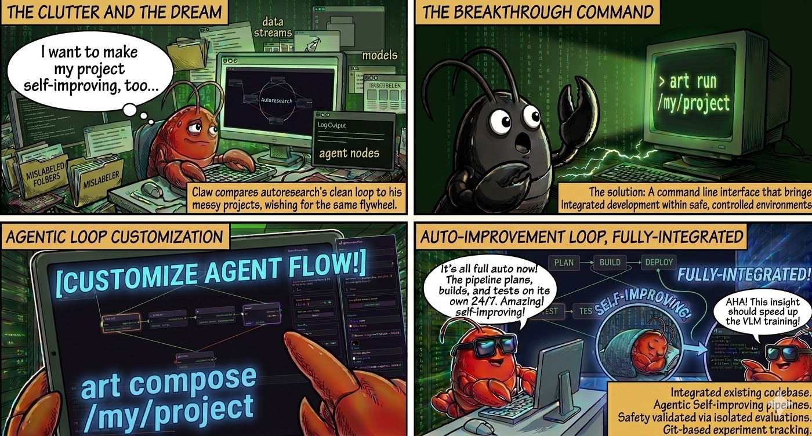

# 🎨 ART: Agent Runtime



> **Alpha release** — expect rough edges. We're iterating fast and would love your feedback.

Turn any existing project into a self-improving pipeline. Draw your own harness for agentic loops.

- 🤖 **Auto Mode** — Full auto 24/7, agents set up their own intuition into next experiment plan
- 🧑‍🔬 **Manual Mode** — Human can interfere via chat and instill their intuition for next trial
- 📊 **Automated Experiment Tracking** via Git
- 🔒 **Isolated containers** for each agent, for proper sandboxing during evaluation
- 🔄 **Agentic loop customizable** via `art compose /my/project`

### Install

Prerequisites: **Docker**, **Git**, **Node.js ≥ 20**, **Claude Code CLI**

```bash
# Install ART (pick one)
npm install -g @aer-org/art
curl -fsSL https://raw.githubusercontent.com/aer-org/art/main/install.sh | bash
```

For your own projects, just point ART at any directory:

```bash
art run /my/project
```

Requires **Node.js ≥ 20** and **Docker** (or Podman).

## Quick example demo: [autoresearch](https://github.com/karpathy/autoresearch) as a pipeline

ART can harness [karpathy/autoresearch](https://github.com/karpathy/autoresearch) with clear stage separation: **build** stage modifies `train.py`, a separate **test** stage runs the experiment, and a **review** stage decides whether to keep or revert, all in isolated containers.

```bash
git clone https://github.com/aer-org/art
cd art/examples/autoresearch
art run .  # requires NVIDIA Ampere+ GPU
```

---

## Why ART

| Without ART | With ART |
|---|---|
| One-off chat sessions, lost context | Repeatable agent workflows with run history |
| Agent writes anywhere in your repo | File-level mount permissions (rw / ro / hidden) per stage |
| No structure between steps | Stage boundaries with transitions and retry logic |
| Can't resume after failure | Checkpointed stages, resume from where you left off |
| Secrets leak into agent context | Credential proxy + `.env` shadowed with `/dev/null` |

---

## 30-Second Walkthrough

**1. Run it:**

```bash
art run /my/project
```

Each stage runs a Claude agent in its own Docker container. Your project is read-only by default — specific files get write access only where needed. Everything lands in `__art__/`:

```
my-project/
├── src/, data/, ...                # Your project (read-only by default)
└── __art__/                        # All ART artifacts
    ├── PIPELINE.json               # Pipeline definition
    ├── PLAN.md                     # What you want built
    ├── src/                        # Agent-written code
    ├── outputs/                    # Run outputs
    ├── logs/                       # Per-stage logs
    └── runs/                       # Run history manifests
```

**2. Customize your pipeline:**

```bash
art compose /my/project
```

Opens a browser-based visual editor with an AI chat. Collaboratively design your pipeline — it becomes the contract that stages execute against. The default template: **plan → build → test → review**, but you can design any pipeline.

---

## Two Ways to Run

**🤖 Auto Mode** — Goes full auto 24/7. The planner agent sets up its own intuition into each experiment plan, runs trials, reviews results, and loops back. You wake up to a git log of everything it tried.

**🧑‍🔬 Manual Mode** — Human in the loop. You can interfere via chat at any point and instill your own intuition for the next trial. Good for early exploration where you want to steer.

All experiment history is tracked automatically via Git — every run, every plan revision, every result.

---

## How Pipelines Work

A pipeline is a list of stages connected by transitions. Each stage runs in its own container and communicates via **output markers**.

Here's what the **default template** looks like — but ART has no hardcoded stage knowledge. It understands stages, transitions, mounts, and markers. Design any pipeline via `art compose`.

```
    ┌──────────┐
    │  BUILD   │ ← reads PLAN.md, writes code to src/
    └────┬─────┘
         │ [STAGE_COMPLETE]
         ▼
    ┌──────────┐
    │   TEST   │ ← runs tests against src/
    └────┬─────┘
         │ [STAGE_COMPLETE]
         ▼
    ┌──────────┐
    │  REVIEW  │ ← examines outputs, writes REPORT.md
    └────┬─────┘
         │ [STAGE_COMPLETE]
         ▼
    ┌──────────┐
    │ HISTORY  │ ← distills insights into MEMORY.md
    └──────────┘
```

### Stage modes

- **Agent mode** (default): Claude agent receives a prompt and works autonomously
- **Command mode**: Runs shell commands via `sh -c`, parses markers from stdout

### Transitions and retries

Stages emit markers like `[STAGE_COMPLETE]` or `[STAGE_ERROR: msg]` to trigger transitions. Retry transitions re-send the prompt with the error description. Non-retry transitions advance to the next stage.

### Resume on interrupt

Completed stages are checkpointed. On restart, execution resumes from the next incomplete stage with previous context.

---

## Customizing Pipelines

```bash
art compose /my/project
```

Opens a ComfyUI-style browser-based visual editor (React + ReactFlow) where you can:

- Drag-and-drop stage nodes and wire them with transition edges
- Configure per-stage: prompt, mount policies (rw/ro/hidden), container image
- Browse your project's mount tree and override sub-directory permissions
- Pick from preset base images (Ubuntu, CUDA, Python, Node, ROS)
- Chat with an AI agent to collaboratively design your plan
- Review diffs with hunk-based AI edit suggestions

---

## Security

Agents run in containers with minimal access:

- **File-level mount permissions** — project defaults to read-only; write access granted per stage
- **`.env` shadowed with `/dev/null`** — secrets never exposed inside containers
- **Credential proxy** — containers never see real API keys; a host-side proxy injects credentials per-request
- **Per-stage isolation** — each stage gets independent mount configuration
- **Mount allowlist** — additional mounts validated against external allowlist

ART is designed to reduce accidental access and constrain agent execution, but it is not a formal sandbox. See `docs/SECURITY.md` for the full trust model and known limitations.

---

## CLI Reference

```bash
art compose <path>              # Open visual pipeline editor
art compose --headless <path>   # One-shot planning agent (no browser, CI-friendly)
art run <path>                  # Execute pipeline
art run --skip-preflight <path> # Skip Claude CLI/auth check (command-mode only)
art update                      # Rebuild all images in the registry
```

---

## Status

ART is under active development. Core pipeline execution, the visual editor, and container isolation are functional. The API surface may change between minor versions.

**Supported:** Linux, macOS · **Not supported:** Windows (use WSL)

---

## Documentation

| Document | Content |
|----------|---------|
| `docs/PIPELINE-REFERENCE.md` | PIPELINE.json field reference — stages, mounts, transitions, command mode |
| `docs/ARCHITECTURE.md` | System architecture — pipeline FSM, container runtime, mount isolation |
| `docs/REQUIREMENTS.md` | Design philosophy and decisions |
| `docs/SECURITY.md` | Trust model, mount isolation, credential proxy |
| `docs/TESTING.md` | Test files, mocking patterns, E2E tests, CI configuration |

---

## Development

```bash
git clone https://github.com/aer-org/art.git
cd art
npm install
npm run build        # Compile TypeScript
npm run dev          # Watch mode
./container/build.sh # Rebuild agent container
npm test             # Unit tests
npm run test:e2e     # E2E tests (Docker required)
```

---

## License

Released under **Apache-2.0**.
